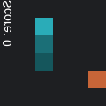

# Snake AI 训练项目

## 简介

本项目使用强化学习算法PPO（Proximal Policy Optimization）训练一个智能体玩贪吃蛇游戏。通过与环境的交互，智能体将学会如何控制蛇的方向以获取食物并避免撞到墙壁或自身。

## 文件说明

- [SnakeEnv.py](SnakeEnv.py): 包含环境定义和游戏逻辑。
- [test_poo.py](test_poo.py): 包含测试智能体的主要代码。
- [train_poo.py](train_poo.py): 包含训练智能体的主要代码。

## 训练结果

